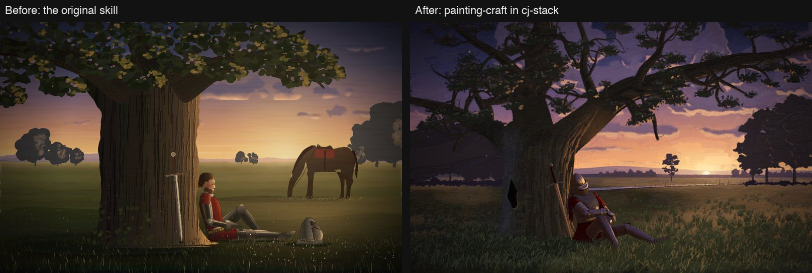
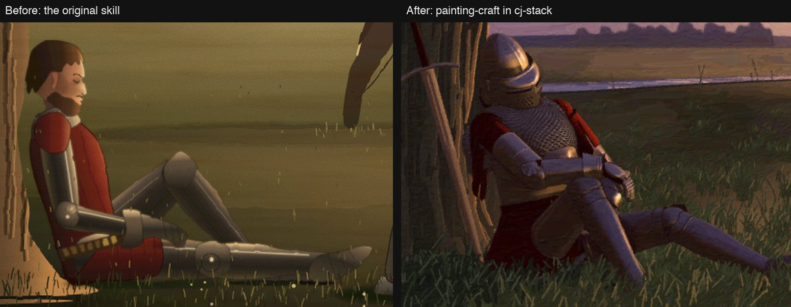
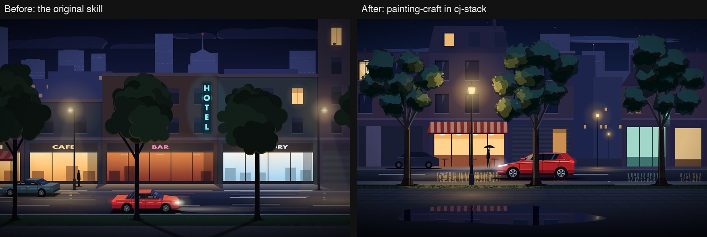
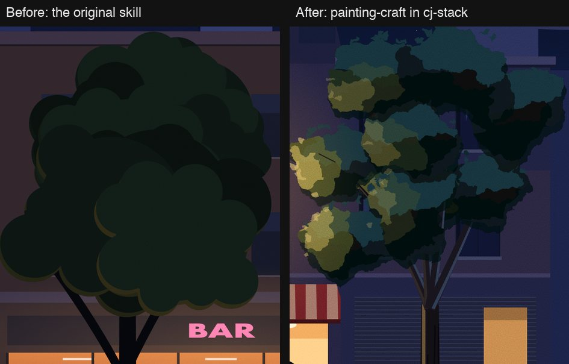

# cj-stack

CJ's skills and mods for Claude Code.

- [Install](#install)
- [Skills](#skills): maintained skills, shipped in `cj-stack` and `cj-paint`
- [Archived skills](#archived-skills): kept for reference, not maintained
- [Mods](#mods): hooks that change how a session behaves, one plugin each
- [Other plugins](#other-plugins): opt-in skill sets
- [Models](models/README.md): which model does what, and why cross-vendor review stays
- [painting-craft: before and after](#painting-craft-before-and-after)

## Install

```
/plugin marketplace add cpeaustriajc/cj-stack
/plugin install cj-stack@cj-stack
/plugin install linear-gate@cj-stack
```

Add any mod or other plugin the same way: `/plugin install <name>@cj-stack`.

- While editing a mod, add the local clone instead (`/plugin marketplace add ~/Projects/cj-stack`):
  a directory marketplace hot-reloads.
- Other agents (Codex and anything that reads `~/.agents/skills`): `scripts/link-skills.sh`.

## Skills

All skills are model-invoked (Claude picks them from their description), except `commit` and
`create-pr`, which run only when typed.

| Skill | Bucket | What it is for |
|---|---|---|
| [work-planning](skills/planning/work-planning/SKILL.md) | planning | shaping work in any tracker (Linear, Jira, GitHub, others): specs, work items, phases, projects, updates |
| [triage](skills/planning/triage/SKILL.md) | planning | sizing an idea or change, then interviewing me in short rounds of questions, each with a recommended answer, until a plan or idea has no open decisions |
| [project-knowledge](skills/knowledge/project-knowledge/SKILL.md) | knowledge | a decision log and research pages in the team's wiki, Notion, Linear, Obsidian or Confluence |
| [hone](skills/knowledge/hone/SKILL.md) | knowledge | mining past transcripts for my repeated corrections, or one skill's with `/hone <skill>`, and proposing where each lesson should live or what to prune: code, lint, hook, test, skill or instruction file |
| [playbooks](skills/quality/playbooks/SKILL.md) | quality | bug, refactor, performance and feature playbooks that each carry their own proof (a reproduced bug, pinned behaviour, a baseline) |
| [break-it](skills/quality/break-it/SKILL.md) | quality | driving the app as careless, impatient or confused users and worst-case data, then reporting ranked bugs with video and repro steps |
| [ui-polish](skills/quality/ui-polish/SKILL.md) | quality | reviewing a UI and its motion against the design and a list of common mistakes, as a Before/After/Why table |
| [feature-files](skills/quality/feature-files/SKILL.md) | quality | one short file per feature saying how to reach, drive and check it, so E2E checks read only what they need |
| [interrogate](skills/quality/interrogate/SKILL.md) | quality | reviewing a diff with fresh Claude reviewers that each see a different slice of it, then filtering into act on, consider, noted and dismissed |
| [commit](skills/shipping/commit/SKILL.md) | shipping | typed `/commit`: small commits in the repo's style, then push (the desktop Commit and push button) |
| [create-pr](skills/shipping/create-pr/SKILL.md) | shipping | typed `/create-pr [draft]`: commit, check, push and open a PR linking the issue and evidence (the desktop Create PR button) |
| [painting-craft](skills/craft/painting-craft/SKILL.md) | craft | drawing and painting in code to a gallery standard, with a screenshot review loop |

`craft` skills ship in `cj-paint` (see [Other plugins](#other-plugins)). Shipped skills stay tool-neutral:
tool specifics go in a skill's adapters, and a project's own facts stay in that project.

## Archived skills

Written for one project and still naming its files. Some ship in `cj-jira`; none are maintained.

| Skill | What it was for |
|---|---|
| [jira-ticket](skills/archived/jira-ticket/SKILL.md) | Jira tickets and acceptance criteria |
| [draft-ticket](skills/archived/draft-ticket/SKILL.md) | end-to-end Jira ticket drafting |
| [github-issue](skills/archived/github-issue/SKILL.md) | GitHub issues holding a Jira ticket's engineering detail |
| [linear-planning](skills/archived/linear-planning/SKILL.md) | Linear-only predecessor of work-planning (not shipped) |
| [linear-project](skills/archived/linear-project/SKILL.md) | Linear-only predecessor of work-planning (not shipped) |
| [project-wiki](skills/archived/project-wiki/SKILL.md) | GitHub-wiki-only predecessor of project-knowledge |

## Mods

| Mod | What it does | Install |
|---|---|---|
| `linear-gate` | holds every Linear write until you allow it | by default |
| `usage-pace` | weekly usage in the status line, and whether it lasts until your reset | optional |
| `session-modes` | `/mode audit`, `no-pr` or `chat`, enforced for the session | optional |
| `denial-explainer` | names the rule behind an auto-mode denial and the allow rule that would cover it | optional |
| `loop-brake` | ends a turn after N forced Stop-hook continuations | optional |
| `hone-nudge` | suggests `/hone <skill>` when you corrected Claude during a cj-stack skill run | optional |
| `secret-guard` | keeps secret values out of Claude's context: redacts tool output, denies encode-or-test tricks; needs `python3` | recommended |

## Other plugins

| Plugin | Contents | Install |
|---|---|---|
| `cj-paint` | painting-craft | where you paint in code |
| `cj-jira` | archived Jira-era skills | only for a Jira client |

## painting-craft: before and after

The same two prompts, each run once in a fresh session: the original skill on the left, the current
painting-craft on the right. Nothing was touched up by hand.

**"Paint a 1600x1000 SVG of a knight asleep against an oak tree at dusk, in a Romantic oil-painting look."**



At 2× zoom, where the viewer looks. The knight is a 3D figure lit by the low sun, with separate
plates, mail in rows and a visor, instead of a mannequin of tubes:



**"Draw a night city street as a 1600x1000 SVG: a car passes behind a row of trees on the near verge.
Flat vector style, but it must not look cheap."**



At 2× zoom, a crown is clumps hung on a branch skeleton, in three values with broken edges, instead
of a pile of round blobs:



What changed: build recipes for the parts that fail up close (`references/recipes.md`), studies of
each hero element against fetched public-domain references before composing (`scripts/refs.py`,
`scripts/compare.py`), the bundled 3D figure renderer, a paint pass that unifies painted styles
(`scripts/paintpass.py`), and delivery at twice the display size.
